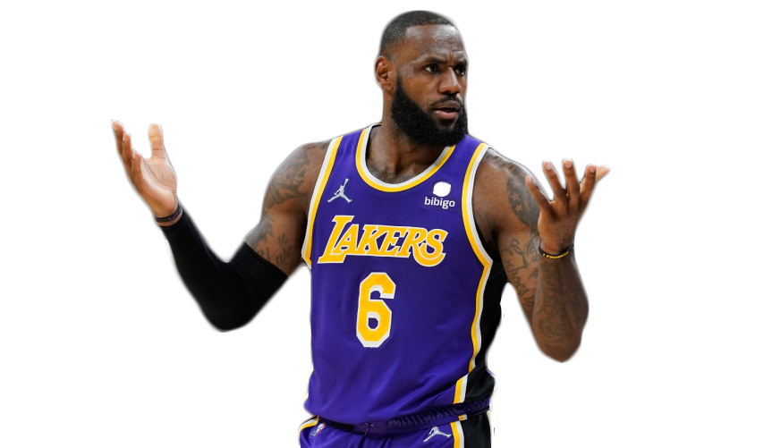
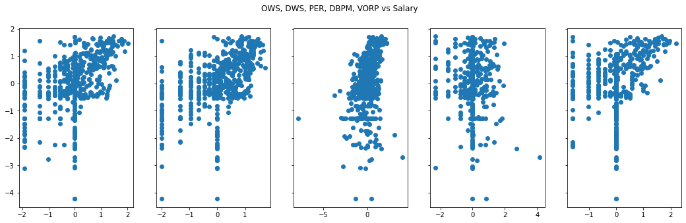
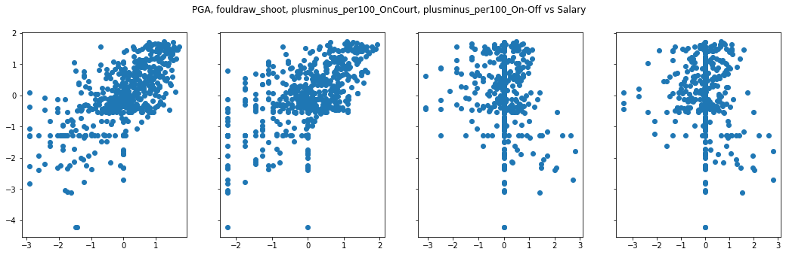
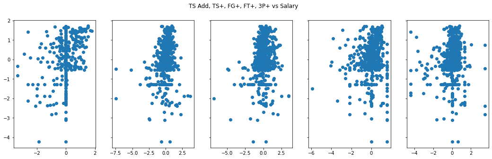

# Academy Xi Capstone Project

## Overview
This project is an opportunity to apply all concepts and techniques I have learned during the Data Analytics Transform Course to real world data. Through exploratory data analysis and linear regression, this report will generate 5 key insights that will inform an NBA player what skills he can improve to secure his next NBA contract

I chose a data set and business problem centred around the NBA and basketball because I am a long time fan of the game. My domain knowledge both statistically and in real world application will serve as an advantage as I understand the nuances of this analysis.

## Business Problem
An up and coming NBA trainer would like to create a training regimen for NBA players, specifically rookies and final year contract players looking to extend their NBA career and get another contract from the 2023-24 NBA season and beyond.

The aim is to provide insights about their stats in the past season and compare it to trends in the current NBA play style.

The model generated will be based on prediction, maximising the effect of the co-efficients so that a player can secure the biggest possible contract.

## Data Understanding
The data for this project is sourced from [Basketball Reference](https://www.basketball-reference.com/). and [Hoops Hype.](https://hoopshype.com/) Both websites are trusted and reputable sources for NBA statistics and news. The data is taken from the latest season 2022-23 as it represents the trends in the current NBA landscape. 

[The 2022-23 season](https://www.basketball-reference.com/leagues/NBA_2023_totals.html) Basketball Reference page provides a wide variety of stats for each player such as the basic stats points, rebounds and assists to their shot tendencies. The data collated include:

* Totals
* Per Game
* Advanced
* Play-by-Play
* Shooting
* Adjusted Shooting

The player's salary is web scraped from the page [2022-23 NBA Player Salaries](https://hoopshype.com/salaries/players/2022-2023/) on Hoops Hype.

## Method
The initial plan for data analysis was to join all the different counting and advanced stats into one data set. From there, I wanted to identify the stats that correlated strongest with the dependent variable, salary. However, with each subsequent iteration, high multicollinearity remained present. This is a given since the structure of the data set is highly correlated to begin with. 

Why is the data set highly correlated? A quick explanation into how advanced stats are derived will provide more context.

A counting stat represent tangible actions a player accumulates during a game. An example would be field goal percentage (FG%)

FG% = FG / FGA

FG includes all shots made (2pt and/or 3pt) therefore all columns based on FG will be correlated.

An advanced stat uses a modifier together with counting stats to understand the effect of a tangible action. An example would be effective field goal percentage (eFG%). eFG% captures scoring efficiency per field by giving weight to the number of field goals made by 1.5 if the field goal made is a three point attempt.

eFG% = (FG + 0.5 * 3P) / FGA. 

All stats are important on their own as a way of describing a player's tendendcies but end up being highly correlated data. Therefore it was difficult to observe the true effect of the co-efficients and the statistical significance. As it was seen in each model created, there were many independent variables with co-efficients that had an effect on salary however the list of independent variables that had statistical signifcance was quite small in comparison and did not match with the effect in reality.

The next best step was to create a model for each data set to reduce multicollinearity. Since high correlation still remains, instead of declaring which independent variables have the strongest effect on salary, it would be best to identify a trend across all models.

## Evaluation
Below are the scatter plots of each model with variables that are statistically significant and high co-efficients. 

Based on the counting stats (the first 2 scatter plots), a player that can get defensive rebounds, score many points or generate many assists. This is very general as any player should work on these parts of the game all the time. What is a more interesting to observation is that offensive rebounds, steals and 2 point shots do not contribute to salary. This is reflective of the current playstyle of the NBA. Offensive rebounds and steals often places individual players out of position on defence which can hurt the overall team defence. 2 point shots, generally from mid-range also places players out of position on offence.

Based on the advanced stats (the last 4 scatter plots), it is difficult to quantify defence however it was shown here that defence or offence is not more important than each other, as long as the player contributes win shares. This is also supported by the minimal effect that the plus minus stats have. In general, the way a player plays should contribute to wins and that will bring a bigger contract.

For example a player that scores 20 points and their team has a positive win percentage will be perceived as more valuable than a player that scores 25 points per game but their team has a negative win percentage.

The final question is what can a player improve on offensively to secure the next big contract? The shooting advance stats show that True Shooting (TS) is most valuable. In essence, a player that has a high effective field goal percentage (eFG%) AND can get to the free throw line. As the other advanced shooting stats suggest, it is not about how many shots a player attempts but more about making the shot and staying efficient. The player should focus on making shots close to the rim (dunks and layups) and any 3 point shot. If the player is not an effective 3 point shooter, an alternative is being an off ball threat to score 2 points.

## Conclusion
Given the multicollinearity in the models, I suggest a player focus on these aspects to secure an NBA contract:

* Improve 3 point shooting or being an off ball threat
* Use playing time to win the game, not to accumulate individual stats
* Avoid offensive rebounds and steals. Stay within the team offence and defence structure

## Further Improvements

Every model exhibited high multicollinearity and is leptokurtic (heavy tails, more outliers). I would like to investigate how sport statistics manage their data for analysis or investigate other regression models. It was not covered in this course but I would incorporate VIF scores and see the effect on identifying multicollinearity.

I would also expand the rows in the data by including data from previous seasons, as far back as 5 seasons. A one season data set contained large variance and after transformations, the rows reduced dramatically. A larger data set could balance the variance and address the outliers.